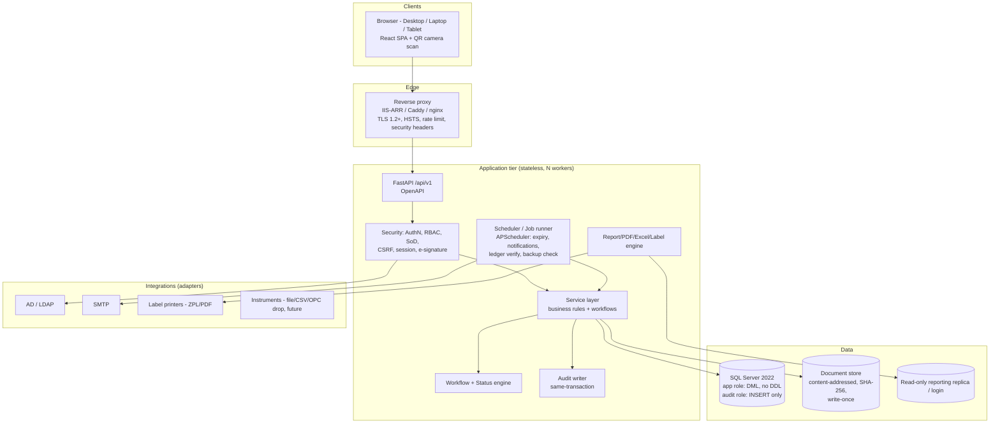

# 01 — System Architecture (Deliverable A)

## 1. Logical view



## 2. Layering (enforced by import rules + tests)

```
api  →  services  →  repositories  →  models(SQLAlchemy)
 │         │
 │         ├→ workflows (state machines, approval engine)
 │         ├→ audit    (AuditContext, diff capture, hash chain)
 │         ├→ security (authn, permissions, e-signature)
 │         └→ integrations (ldap, smtp, printers)
 └ schemas (Pydantic request/response, never ORM objects)
```

* **API layer** — thin: parse/validate, dependency-inject `CurrentUser` + `AuditContext`, call one service method, map errors. No business logic, no SQL.
* **Service layer** — one *unit of work* per use case. Opens the DB transaction, performs rule checks, writes domain rows + inventory ledger + audit + signature **atomically**; commit or roll back everything. Domain services never commit mid-way.
* **Repository layer** — query construction only; every GMP table access goes through repositories so paging/filtering/permission scoping is uniform.
* **Rule engine** — each business rule is a small, named, unit-tested callable registered with a rule ID (`BR-PO-001`). Services invoke rule sets; failures return structured `RuleViolation(rule_id, message, severity)` and are logged to the security/GMP log. Rules are **never** duplicated in the frontend (the UI only mirrors them for convenience).
* **Status engine** — `StateMachine` definitions (allowed transitions, required permission, signature meaning, pre-conditions, post-actions). Only `transition(record, to_status, user, signature?)` can change a status column; the column is excluded from all update schemas and a DB-level CHECK/trigger limits legal transitions for the critical tables (lot disposition, PO, vendor qualification).
* **Workflow engine** — configurable approval chains (steps, role, min approvals, e-sig required, SLA, escalation, rejection route) stored as versioned config; a `workflow_instance` is pinned to the definition version in force at submission time.

## 3. Cross-cutting design

### 3.1 Audit trail architecture
* `AuditContext` (request-scoped): user, role, session id, IP, user-agent/device id, correlation id, reason.
* SQLAlchemy `before_flush` hook captures per-field `old → new` for every audited model (opt-in via `AuditedMixin`), and inserts rows into `audit_trail` **in the same transaction** as the business change. If the audit insert fails, the business change rolls back (no un-audited GMP change possible).
* Non-CRUD events (login, logout, failed login, print, download, export, label print, document access, deletion attempt, config change) written explicitly by `AuditService.log_event()`.
* Table `audit_trail`: `audit_id (bigint identity), occurred_at_utc, tz_name, module, entity, record_id, action, field_name, old_value, new_value, user_id, user_name, role_name, session_id, ip_address, device_info, reason, signature_id (nullable FK), correlation_id, prev_hash, row_hash`.
* Immutability: see C-06 (grants + triggers + hash chain + optional Ledger table). Verification endpoint `/api/v1/audit-trail/verify` recomputes the chain.
* Review: scheduled "audit-trail review" tasks (Annex 11 §9) generate reviewable batches of audit records with a signed review record.
* Separation of logs (§63): (1) application log (JSON, file), (2) security log (authn/authz/lockout/rule violations, separate file + table), (3) `audit_trail`, (4) `gmp_transaction_history` views (domain-level business history built from ledger + status history tables). Never mixed.

### 3.2 Electronic signature architecture
```
User clicks "Approve" → modal (meaning, comment, password) → POST /…/sign
 → fresh auth (LDAP bind or Argon2id verify; counts toward lockout)
 → authorisation check (permission + role + SoD + training valid)
 → canonicalise record snapshot → record_hash = SHA-256
 → INSERT e_signature(user, full name, role, meaning, reason, utc_ts,
        entity, record_id, record_version, record_hash, auth_method, ip)
 → apply status transition + audit rows referencing signature_id
 → commit (one transaction)
```
* Signature rows are append-only (same immutability controls as audit).
* The printed/PDF signature manifestation shows **printed name, date/time (with TZ), meaning** (Part 11.50).
* If the signed record is later amended, the new version gets new signatures; the old signature still points to the old version hash (Part 11.70 linking).

### 3.3 Security architecture
| Concern | Control |
|---|---|
| Authentication | `AuthProvider` interface: `LocalProvider` (Argon2id), `LdapProvider` (ldap3, LDAPS, group→role mapping optional). Fallback order configurable. |
| Password policy (local) | length ≥ 12, complexity, history (last 12), max age, forced change at first login, lockout after N failures (default 5) with timed/QA-unlock, no reuse. |
| Sessions | Server-side session table; opaque ID in `HttpOnly; Secure; SameSite=Strict` cookie; idle timeout (default 15 min) + absolute timeout (8 h); concurrent-session policy configurable (single session per user for approvers); revoke on password change. |
| CSRF | Double-submit token for cookie-authenticated state-changing requests. |
| XSS | React escaping, strict CSP, output encoding in server-rendered PDF/HTML templates (Jinja autoescape). |
| SQLi | SQLAlchemy parameterized queries only; lint rule bans raw string SQL. |
| Input validation | Pydantic strict models; server-side only trusted; max lengths; enumerations. |
| File uploads | extension + magic-byte allow-list (PDF, XLSX, DOCX, PNG, JPG), size limit, SHA-256, store outside webroot under random names, pluggable AV scanning hook (ClamAV), no execution, download via authorised endpoint (audited). |
| Rate limiting | Per-IP and per-user on auth + sensitive endpoints (SlowAPI / proxy). |
| Secrets | Only via environment / secret store; `.env.example` placeholders; secret scan in CI; DB encryption key & signing key rotation procedure. |
| Transport/at rest | TLS everywhere; SQL Server TDE / BitLocker; document store on encrypted volume; SMTP STARTTLS. |
| Errors | Global handler returns `{message, reference: ERR-YYYY-NNNNNN, correlation_id, timestamp}`; stack trace only in app log. |
| Authorisation | Permission = `module.resource.action` (e.g. `po.order.approve`). Checked in service layer (not only router). Data-scope filters (site, department). Access expiry and temporary disable honoured on every request. |
| DB accounts | `merp_migrator` (DDL, used only at deployment), `merp_app` (DML on app tables; no DDL; no audit UPDATE/DELETE), `merp_audit_writer` (INSERT on audit/signature) — optional split, `merp_report_ro` (SELECT on reporting views), `merp_dba` (named admins, outside the app). No `db_owner` for the app. |

### 3.4 Data integrity (ALCOA+) design points
* Every GMP row: `created_at_utc, created_by, row_version` (optimistic concurrency); modifications by controlled update create audit rows, or **new version rows** for versioned masters.
* Versioned masters (specification, STP, BOM, sampling plan, vendor qualification, workflow definition, label template): `(entity_code, version_no)` unique, `status`, `effective_from/to`, `supersedes_id`; transactions store the **FK to the exact version row**, so history can't be rewritten.
* Test results: immutable once `SUBMITTED`; corrections are separate `qc_result_amendment` rows (original retained).
* Documents: write-once; replacement = new version + link.
* Numbering: `number_sequence` rows locked with `UPDLOCK/HOLDLOCK` (or `SEQUENCE`) inside the business transaction; format template per document type per site per year.

### 3.5 Performance design (50 concurrent, 100k+ transactions, large audit trail)
* Stateless API, 4–8 workers, SQLAlchemy connection pool; all lists server-side paginated (keyset where large: audit, ledger, QC results).
* Index strategy: composite indexes on `(material_batch_id, status)`, `(site_id, created_at)`, ledger `(material_batch_id, txn_ts)`, audit `(entity, record_id, occurred_at)` and `(user_id, occurred_at)`; filtered indexes for open statuses.
* Audit table partitioned by month/year (MSSQL partition scheme) once > N rows; older partitions archived under the retention policy.
* Dashboards use pre-aggregated reporting views + short TTL cache; reports run against `merp_report_ro`.
* Long-running exports/reports run as background jobs with download link.

### 3.6 Error handling & observability
* Correlation ID middleware (header `X-Correlation-ID`), propagated to all logs/audit.
* Health endpoints `/health/live`, `/health/ready` (DB, doc store, scheduler).
* Admin "System health" page: DB status, last backup (read from `backup_job_log`, populated by a backup script/agent), disk, job-runner state.

### 3.7 Backup, recovery (§58)
* **RPO** ≤ 15 min (full nightly + differential 6-hourly + log backup every 15 min), **RTO** ≤ 4 h — *proposed targets, to be agreed per site*.
* Backup verification: `RESTORE VERIFYONLY` + weekly restore test to a scratch DB with row-count + audit-hash-chain verification; document store synced with hash manifest.
* Procedures delivered in `docs/validation/` (backup/restore qualification protocol) and `docs/architecture/` DR plan.

## 4. Project structure (as §81)

```
backend/app/{api,core,models,schemas,services,repositories,workflows,security,audit,reports,integrations,utils}
frontend/src/{components,pages,layouts,services,hooks,utils,styles}
database/{migrations/{versions,dialect},seeds}
tests/{unit,integration,security,workflows}
docs/{URS,architecture,validation,SOP}  scripts/  docker/
```

## 5. Technology decisions (with rationale)
| Area | Choice | Rationale |
|---|---|---|
| API | FastAPI + Pydantic v2 | Typed contracts, OpenAPI for free, async-capable |
| ORM | SQLAlchemy 2.x (typed `Mapped[]`) + Alembic | Mature MSSQL/PG dialects, migration traceability |
| MSSQL driver | `pyodbc` + ODBC Driver 18 (`mssql+pyodbc`) | Supported, works on Windows/Linux |
| Passwords | Argon2id (`argon2-cffi`) | Modern memory-hard hash |
| LDAP | `ldap3` | Pure Python, LDAPS support |
| Scheduler | APScheduler (in-process, DB job store, single-leader lock) | No extra infra on a LAN |
| PDF | WeasyPrint (ReportLab fallback) | HTML templates reuse branding |
| Excel | openpyxl / XlsxWriter | Export + import validation |
| Barcode/QR | `python-barcode` (Code128), `qrcode` | Server-side label rendering |
| Stats | NumPy/SciPy (Shapiro-Wilk, etc.) | Capability indices, normality |
| Tests | pytest, httpx TestClient, Playwright (UI smoke), testcontainers (MSSQL/PG) | Per §77 |
| Frontend | React 18 + TS + Vite, Bootstrap 5, TanStack Table, ECharts, react-query | Enterprise tables/dashboards |
| Container | Docker (app + mssql + proxy) and Windows service procedure | §82/§83 |

## 6. Deployment topologies

```
LAN single host:   Browser → Caddy/IIS(443) → Uvicorn workers (service) → SQL Server
Containerised:     Browser → nginx → api (gunicorn+uvicorn) → mssql   (+ volume: documents)
Validated prod:    2 VMs (app, DB) + backup target + time source (NTP/AD) + AV
```
Environments for GMP: **DEV → TEST/UAT (validation) → PROD**, with controlled promotion (release package, hash, release note, change-control reference).

## 7. Extensibility
* Modules are Python packages registering: routers, permissions, state machines, audit entities, menu items, report definitions, notification types, via a `ModuleRegistry`. Adding a module = add package + migration; no core redesign.
* Event bus (in-process, transactional outbox table) for cross-module reactions (e.g. `GRN.verified → create quarantine lot`, `QA.released → generate label/COA`), keeping modules decoupled.
