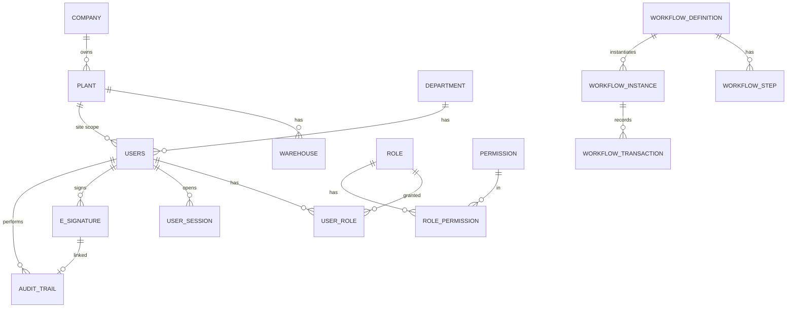
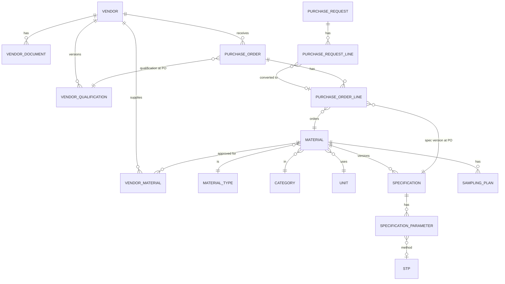
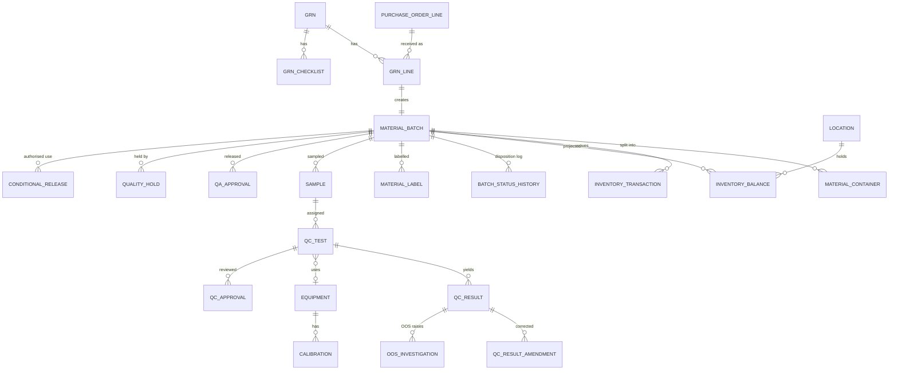
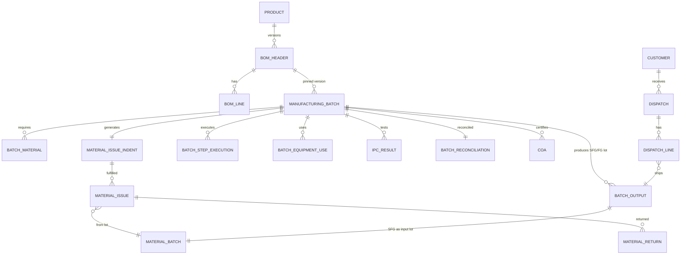
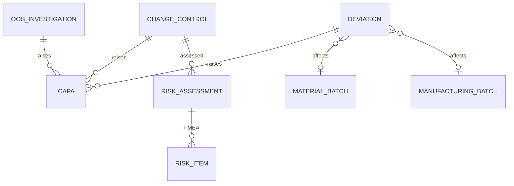

# 03 — Database Design (Deliverables C & D)

## 0. Conventions (apply to every table unless stated)

| Item | Rule |
|---|---|
| PK | `id BIGINT IDENTITY` (surrogate). Public references use business numbers (`po_no`, `grn_no`) with UNIQUE constraints. |
| Standard columns | `site_id FK`, `created_at_utc`, `created_by FK users`, `updated_at_utc`, `updated_by`, `row_version` (optimistic concurrency, `rowversion`/int). Omitted on append-only tables (marked **AO**). |
| **AO** tables | Append-only: ledger, audit, signature, status history, QC amendments. No UPDATE/DELETE privilege; triggers enforce. |
| **VER** tables | Versioned master: `(code, version_no)` UNIQUE, `status`, `effective_from`, `effective_to`, `supersedes_id`; approved versions immutable. |
| Status | `VARCHAR` + `CHECK (status IN (...))`; transitions through Status Engine only (C-04). |
| Delete | No physical delete of GMP data; masters use `is_active`/`status`. FKs `ON DELETE NO ACTION`. |
| Quantities | `DECIMAL(18,6)`, `CHECK(qty >= 0)` where applicable. |
| Time | UTC `datetimeoffset(3)` / `timestamptz`; dates (expiry, mfg) are `DATE`. |
| Naming | `snake_case`, singular table names (listed as the prompt's PascalCase in brackets for traceability to §75). |

## C. ER diagrams (by domain)

### C.1 Identity, organisation, platform

### C.2 Master data, vendor, purchase

### C.3 Receipt → inventory → QC → release

### C.4 Manufacturing → FG → dispatch

### C.5 Quality system

> **Key lineage guarantee (§45/§76):** *every* consumption row (`material_issue`) FKs to both `material_batch` (source lot, which FKs `grn_line → po_line → po → vendor`) and `manufacturing_batch`. SFG output becomes a `material_batch` (type SFG) so FG genealogy recurses through the same table.

---

## D. Table list

Notation: **PK** primary key · **FK** foreign keys · **UQ** unique constraints · prompt §75 name in brackets.

### D.1 Platform / IAM / Org
| Table | PK | FKs | Important fields / constraints | Relationships |
|---|---|---|---|---|
| company | id | – | name, address, gst_no, drug_licence_no, mfg_licence_no, logo_doc_id, header/footer html, date/time format | 1—N plant |
| plant [Plants] | id | company_id | plant_code UQ, name, timezone | 1—N warehouse, users |
| department [Departments] | id | plant_id | code UQ, name | 1—N users |
| users [Users] | id | department_id, plant_id | username UQ, full_name, email, designation, auth_source(LOCAL/LDAP), password_hash, is_active, locked_until, failed_attempts, password_changed_at, access_expiry, must_change_pwd | N—N role |
| role [Roles] | id | – | role_code UQ, name, is_system | N—N permission |
| permission [Permissions] | id | – | perm_code UQ (`module.resource.action`), module, action | |
| user_role [UserRoles] | id | user_id, role_id, granted_by | valid_from, valid_to, is_disabled; UQ(user,role,valid_from) | |
| role_permission [RolePermissions] | id | role_id, permission_id | UQ(role,perm) | |
| user_session | id (uuid) | user_id | created, last_seen, ip, user_agent, revoked_at | |
| password_history | id | user_id | hash, set_at | |
| training_record | id | user_id, document_id | doc_version, trained_on, valid_until | gates signing (G-04) |
| sod_rule | id | – | action_code, conflicts_with_action_code, scope (same record / same batch) | drives SoD checks |
| number_sequence [NumberSequences] | id | plant_id | doc_type, prefix, format, current_value, reset_policy, UQ(plant,doc_type,period) | locked per allocation |
| system_configuration [SystemConfiguration] | id | – | key UQ, value_json, version, change_control_id | VER |
| unit [Units] / unit_conversion | id | – | code UQ, dimension; conversion factor | |
| notification [Notifications] / notification_rule | id | user_id | type, ref_entity/id, due_at, read_at, emailed_at | |
| error_log | id | – | reference_no UQ, correlation_id, ts, user_id, route | technical log index |
| backup_job_log | id | – | type, started, finished, status, verified_at, size | |

### D.2 Audit & signature (AO)
| Table | PK | FKs | Fields | Notes |
|---|---|---|---|---|
| audit_trail [AuditTrail] | audit_id | user_id, signature_id? | occurred_at_utc, tz_name, module, entity, record_id, action, field_name, old_value, new_value, user_name, role_name, session_id, ip, device_info, reason, correlation_id, prev_hash, row_hash | Partitioned by month; INSERT-only; hash chain |
| e_signature [ElectronicSignatures] | id | user_id | signed_at_utc, tz_name, printed_name, role_name, meaning, reason, entity, record_id, record_version, record_hash, auth_method, ip, manifest_hash | INSERT-only |
| security_event | id | user_id? | event_type (LOGIN_FAIL, LOCKOUT, RULE_VIOLATION…), ip, detail | separate from audit (C-06/§63) |
| gmp_status_history | id | – | entity, record_id, from_status, to_status, user_id, signature_id, ts | AO; per-entity views |

### D.3 Master data
| Table | PK | FKs | Important fields | Relationships |
|---|---|---|---|---|
| vendor [Vendors] | id | – | vendor_code UQ, name, type, address, country/state/city, gst, pan, contact, email, phone, bank_json(encrypted), categories, risk_class, criticality, quality_agreement_status, audit_status, approval_status | 1—N qualification, documents |
| vendor_document [VendorDocuments] | id | vendor_id, document_id | doc_type, doc_no, version, issue_date, expiry_date, review_status, approved_by, approved_at | |
| vendor_qualification [VendorQualifications] **VER** | id | vendor_id, approved_signature_id | qualification_no, status (Draft/Under Review/Approved/Conditional/Suspended/Expired/Disqualified), qualified_on, **requalification_due_date**, risk_class, conditional_expiry; UQ(vendor,version) | PO validation reads current effective row |
| vendor_material [VendorMaterials] **VER** | id | vendor_id, material_id, change_control_id | status, approved_from/to, is_primary | UQ(vendor,material,version) |
| material_type [MaterialTypes] / category [Categories] | id | parent_id | code UQ, name | |
| material [Materials] | id | type_id, category_id, base_unit_id | material_code UQ, name, generic_name, grade, pharmacopoeia, manufacturer, pack_size, storage_condition, temp_min/max, humidity_min/max, shelf_life_days, retest_days, gmp_criticality, hazard_class, requires_qc/qa, fefo_mode, min_stock, max_stock, master_status (Draft/Approved/Active/Obsolete) | |
| specification [Specifications] **VER** | id | material_id (or product_id), approved_signature_id | spec_no, version_no, status, effective_from/to, supersedes_id | |
| specification_parameter [SpecificationParameters] | id | specification_id, stp_id | test_name, method, spec_type (NUMERIC/TEXT/RANGE/PASS-FAIL), lsl, usl, target, unit, decimals, acceptance_text, pharmacopoeia_ref, frequency, criticality, alert_low/high, action_low/high | |
| stp [STPs] **VER** | id | approved_signature_id | stp_no, version, title, effective_date, superseded_date, procedure, calculation, acceptance, safety, equipment_required (M2M), reagents | |
| sampling_plan [SamplingPlans] **VER** | id | material_id | plan_code, version, rule (√n+1, fixed, %…), sample_qty, container_rule | |
| warehouse [Warehouses] | id | plant_id | code UQ, name, storage_condition | |
| location [Locations] | id | warehouse_id, parent_id | location_code UQ, type (ZONE/ROOM/RACK/SHELF/BIN), temp/humidity range, allowed_material_categories, capacity, status (hierarchy via parent) | |
| location_compat_rule | id | – | category_a, category_b, allowed | storage incompatibility |
| equipment [Equipment] | id | location_id | equipment_id UQ, name, manufacturer, model, serial_no, qualification_status, status, calibration_due, maintenance_due | |
| calibration [Calibration] | id | equipment_id | performed_on, due_on, result, certificate_doc_id, performed_by | |
| customer [Customers] | id | – | code UQ, name, address, gst, licence_no, authorised_products, is_authorised | |
| product | id | material_id? | product_code UQ, name, type (SFG/FG) | |
| document [Documents] | id | uploaded_by | doc_no, version, effective/expiry, original_name, mime, size, sha256, storage_key, status; **write-once** | M2M to entities via doc_link |
| doc_link | id | document_id | entity, record_id | |
| import_job / import_row | id | uploaded_by, approved_by | entity, status, error_json | staging only |

### D.4 Purchase
| Table | PK | FKs | Important fields |
|---|---|---|---|
| purchase_request [PurchaseRequests] | id | department_id, requested_by | pr_no UQ, date, priority, purpose, status, workflow_instance_id |
| purchase_request_line [PurchaseRequestLines] | id | pr_id, material_id, unit_id, preferred_vendor_id | qty, required_date, remarks |
| purchase_order [PurchaseOrders] | id | vendor_id, **vendor_qualification_id**, pr_id?, workflow_instance_id | po_no UQ, po_date, payment_terms, delivery_date, conditions, quality_requirements, status, validation_snapshot_json (rule results at creation & approval) |
| purchase_order_line [PurchaseOrderLines] | id | po_id, material_id, **specification_id**, vendor_material_id, unit_id | qty, rate, tax_pct, received_qty (derived), status; CHECK(qty>0) |

### D.5 Warehouse / inventory
| Table | PK | FKs | Important fields |
|---|---|---|---|
| grn [GRNs] | id | po_id, vendor_id | grn_no UQ, receipt_date, invoice_no/date, vehicle_no, transport, status (Draft/Submitted/Verified/Quarantine/Rejected), checklist_passed |
| grn_line [GRNLines] | id | grn_id, po_line_id, material_id | vendor_batch_no, qty_received, pack_count, mfg_date, expiry_date, retest_date, coa_received, container/seal/packaging/temperature conditions; UQ(grn,line_no) |
| grn_checklist [GRNChecklists] | id | grn_id, checklist_item_id | answer (Y/N/NA), comment, is_critical |
| checklist_item | id | – | text, is_critical, applies_to_type, version |
| material_batch [MaterialBatches] | id | material_id, grn_line_id?, manufacturing_batch_id? (for SFG/FG), vendor_id? | internal_batch_no UQ(site), vendor_batch_no, mfg_date, expiry_date, retest_date, **disposition** (QUARANTINE/QC_TESTING/QC_APPROVED/QA_REVIEW/APPROVED/REJECTED/…), qc_no, qa_release_no, specification_id |
| material_container | id | batch_id | container_no, qty, location_id |
| inventory_transaction [InventoryTransactions] **AO** | id | material_batch_id, from_location_id, to_location_id, user_id | txn_type (RECEIPT, TRANSFER, SAMPLE, ISSUE, RETURN, REJECT_MOVE, DESTROY, ADJUST, REVERSAL), qty, unit_id, ref_doc_type, ref_doc_id, reverses_txn_id, status, txn_ts |
| inventory_balance [Inventory] | id | material_batch_id, location_id | qty_on_hand, qty_reserved, qty_available (computed); UQ(batch,location); CHECK ≥ 0 |
| material_label [MaterialLabels] | id | batch_id, label_template_id | label_type, label_no, version, copies, printed_by, printed_at, reprint_reason |
| label_template **VER** | id | – | type, layout_json, version |
| quality_hold | id | – | entity (BATCH/MFG_BATCH/FG), record_id, placed_by, reason, placed_at, released_by/at, release_signature_id |
| conditional_release | id | batch_id, risk_assessment_id, intended_mfg_batch_id, approved_signature_id | qty_authorised, qty_used, justification, identity_confirmed, expires_at |
| destruction_record | id | batch_id | qty, method, approved_signature_id |
| storage_temperature_log | id | location_id | reading, ts, excursion flag |

### D.6 QC / LIMS
| Table | PK | FKs | Important fields |
|---|---|---|---|
| sample [Samples] | id | batch_id (or mfg_batch_id), sampling_plan_id | sample_no UQ, sample_type, qty_received, qty_sampled, containers_sampled, sampled_by, sampled_at, location, status, retention_until, disposal_approval |
| qc_test [QCTests] | id | sample_id, spec_parameter_id, stp_id, equipment_id?, analyst_id | status, instrument_calibration_status (snapshot), started_at, completed_at |
| qc_result [QCResults] | id | qc_test_id | result_value, result_text, unit, lsl/usl/target (snapshot), pass_fail, remarks, submitted_at; **immutable after SUBMITTED** |
| qc_result_amendment **AO** | id | qc_result_id, requested_by, approved_signature_id | original_value, new_value, reason, status |
| qc_approval [QCApprovals] | id | sample_id/test_id, user_id, signature_id | level (ANALYST_REVIEW/QC_HEAD), decision, comment |
| qa_approval [QAApprovals] | id | batch_id, user_id, signature_id | decision (RELEASE/REJECT/HOLD), release_no |
| oos_investigation | id | qc_result_id, sample_id | phase, root_cause, decision, status |
| oot_event | id | spec_parameter_id | rule_triggered (Nelson n), value, status |
| stat_config | id | spec_parameter_id | min_n, rules_enabled, alert/action limits |
| coa [COAs] **VER** | id | batch_id/mfg_batch_id, signature_id | coa_no, version, pdf_doc_id, xlsx_doc_id |
| ipc_test_definition / ipc_result | id | mfg_batch_id, stage, equipment_id | parameter, result, limits snapshot, analyst |

### D.7 Manufacturing & dispatch
| Table | PK | FKs | Important fields |
|---|---|---|---|
| bom_header [BOMHeaders] **VER** | id | product_id | bom_no, version, effective dates, batch_size, base_unit, yield_pct, status |
| bom_line [BOMLines] | id | bom_id, material_id | qty, unit, pct, process_loss_pct, overage_pct, sampling_qty, reconcile_flag |
| manufacturing_batch [ManufacturingBatches] | id | product_id, bom_id | batch_no UQ(site), batch_type (SFG/FG), planned_qty, actual_qty, status, start/end, override_reason |
| batch_material [BatchMaterials] | id | batch_id, bom_line_id, material_id | required_qty, issued_qty, status |
| material_issue_indent [MaterialIssueIndents] | id | batch_id | indent_no UQ, status |
| material_issue [MaterialIssues] **AO-ish** | id | indent_id, batch_material_id, material_batch_id, location_id, inventory_txn_id, conditional_release_id? | qty, issued_by, issued_at, fefo_override_reason |
| material_return [MaterialReturns] | id | issue_id | used_qty, returned_qty, damaged_qty, reason, status |
| batch_reconciliation [BatchReconciliation] | id | batch_id | issued, additional, consumed, sampled, waste, returned, unaccounted, tolerance_pct, status, deviation_id? |
| batch_step_execution / mbr_template | id | batch_id | step_no, instruction_version, performed_by, verified_by, ts, values |
| batch_equipment_use | id | batch_id, equipment_id | start/end, cleaning status |
| batch_output | id | batch_id, material_batch_id | qty, yield |
| dispatch [Dispatches] | id | customer_id | dispatch_no UQ, invoice_no, transporter, vehicle, dispatch_date, destination, status |
| dispatch_line [DispatchLines] | id | dispatch_id, material_batch_id (FG), coa_id | qty, pack_size |

### D.8 Quality system & workflow
| Table | PK | FKs | Fields |
|---|---|---|---|
| deviation [Deviations] | id | batch_id?, material_batch_id?, department_id | dev_no, classification, description, investigation, root_cause, status |
| capa [CAPA] | id | source (polymorphic), owner_id | capa_no, action, due_date, effectiveness_check, status |
| change_control [ChangeControls] | id | – | cc_no, current_state, proposed_change, impact, entity/ref_version, effective_date |
| risk_assessment [RiskAssessments] / risk_item | id | – | failure_mode, severity, occurrence, detectability, rpn, mitigation, residual_risk |
| workflow_definition [WorkflowDefinitions] **VER** | id | – | process_code, version, status |
| workflow_step [WorkflowSteps] | id | definition_id, role_id | seq, min_approvals, esig_required, meaning, sla_hours, escalate_to_role_id, reject_to_step |
| workflow_instance / workflow_transaction [WorkflowTransactions] | id | definition_id (pinned), entity, record_id | step, actor, decision, signature_id, ts |

### D.9 Cross-cutting database controls
* **CHECK constraints:** quantities ≥ 0, `expiry_date >= mfg_date`, status domains, `usl >= lsl`, qty_issued ≤ qty_required × (1+overage) unless override row.
* **Triggers (dialect folder):** block UPDATE/DELETE on AO tables; block updates to approved VER rows; restrict legal disposition transitions.
* **Unique business keys:** po_no, grn_no, sample_no, batch_no, dispatch_no, internal_batch_no, qualification(vendor,version).
* **Indexes:** per Doc 01 §3.5; every FK indexed.
* **Row-level security (MSSQL):** `SESSION_CONTEXT('site_id')` predicate on transactional tables when multi-site is enabled; app also filters by site at repository layer.
* **Reporting views:** `vw_stock_*`, `vw_genealogy`, `vw_qc_trend` consumed via `merp_report_ro`.
* **Stored procedures:** only (a) number allocation (optional), (b) ledger-vs-balance verification, (c) audit hash-chain verify. All other logic stays in the service layer for testability.

### D.10 Data dictionary
The Admin Console "Data dictionary" page (§86) is generated from SQLAlchemy metadata + column comments; exported as part of the validation pack.
