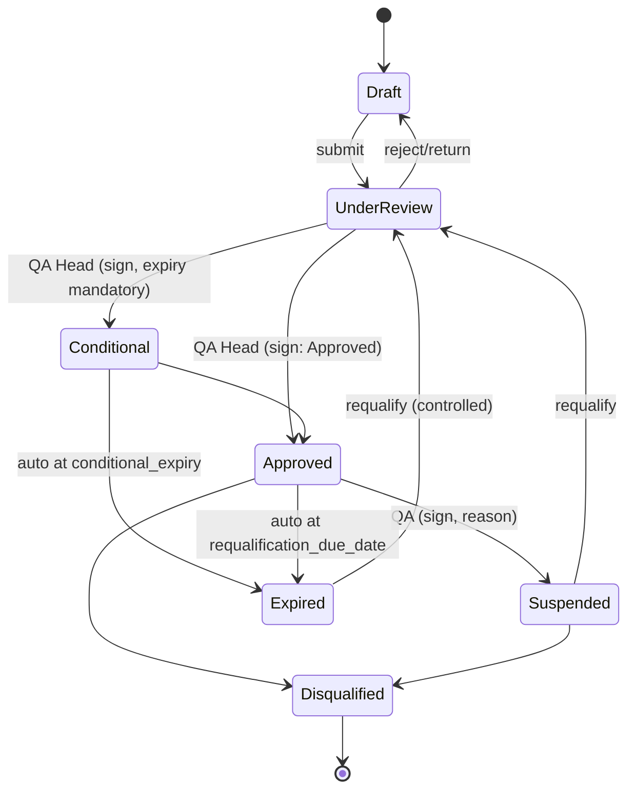
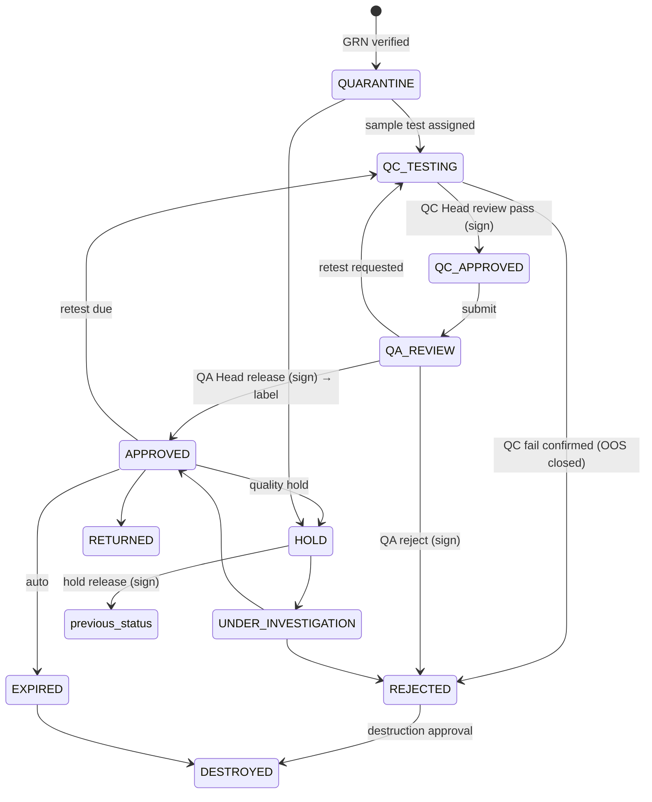

# 05 — Workflow Diagrams & State Machines (Deliverable F)

## 1. End-to-end flow

```mermaid
flowchart LR
  V[Vendor] --> VQ{Qualification<br/>valid & not expired?}
  VQ -- No --> BLK1[[PO BLOCKED]]
  VQ -- Yes --> M[Material + Vendor-Material map + Spec]
  M --> PR[Purchase Request] --> PO[Purchase Order<br/>validate at create + approve]
  PO --> RC[Receipt] --> GRN[GRN + Checklist]
  GRN -- critical fail --> RJ0[[Receipt blocked / reject]]
  GRN --> Q[QUARANTINE lot + label + location]
  Q --> S[Sampling] --> QC[QC testing<br/>calibration gate]
  QC -- OOS --> INV[OOS investigation] --> QC
  QC --> QCR[QC Head review] --> QAR[QA review]
  QAR -- fail --> REJ[REJECTED]
  QAR -- pass --> REL[APPROVED / RELEASED + label]
  REL --> ST[Approved storage]
  ST --> IND[Material issue indent from BOM] --> ISS[Warehouse issue<br/>FEFO, status, expiry, hold gates]
  ISS --> SFG[SFG batch + IPC + reconciliation]
  SFG --> SQC[SFG QC] --> SQA[QA release SFG]
  SQA --> FGB[FG batch: SFG + RM/PM issue + IPC + yield + reconciliation]
  FGB --> FQC[FG QC] --> FQR[QC review] --> FQA[QA review/release + COA]
  FQA --> FGS[FG stock - available]
  FGS --> DSP[Dispatch validation] --> CUS[Customer]
  CUS -. complaint/recall .-> TR[Traceability]
```



## 2. State machines (authoritative; implemented in code)

Format: `FROM → TO [permission · signature meaning · pre-conditions]`

### 2.1 Vendor qualification

*Purchasable* ⇔ status ∈ {Approved, Conditional} **and** today ≤ requalification_due_date (or conditional_expiry) — evaluated live at PO create *and* PO approve (BR-PO-001..003). A nightly job flips status to `Expired` and notifies at 90/60/30/7 days.

### 2.2 Material master
`Draft → Approved → Active → Obsolete` (Draft→Approved: QA, sign; Approved→Active: effective date reached/QA; Active→Obsolete: QA via change control; Obsolete blocks new PR/PO/GRN, never blocks history).

### 2.3 Purchase request
`Draft → Submitted → DepartmentApproval → PurchaseReview → Approved → ConvertedToPO` (+ `Rejected`, `Cancelled`). Steps/roles from workflow definition.

### 2.4 Purchase order
`Draft → PendingApproval → Approved → PartiallyReceived → Closed` (+ `Cancelled`, `Rejected`). **Validation executed at Draft→PendingApproval creation and again at PendingApproval→Approved.** Any change after approval → amendment (new PO revision, re-approval).

### 2.5 GRN
`Draft → Submitted → Verified → Quarantine(lot created)` (+ `Rejected`). Critical checklist "No" ⇒ `Submitted→Verified` blocked; QA may reject receipt or approve *documented exception with signature + deviation* (configurable per item).

### 2.6 Material lot disposition (critical)

**Issuable ⇔** disposition = `APPROVED` ∧ no open hold ∧ not expired ∧ retest valid ∧ qty available — *or* an active, quantity-bounded conditional release (C-02) for non-rejected lots.

### 2.7 Sample / QC test
`Created → TestAssigned → TestStarted → ResultsEntered → AnalystReview → QCReview → QAReview → Released | Rejected`. Result row `DRAFT → SUBMITTED` (locks). Amendment: `Requested → Approved(sign) → Applied`; original retained.

### 2.8 OOS
`Raised → Phase I (lab investigation) → [Invalidated → Retest] | Phase II (full) → RootCause → CAPA → QA Decision (sign) → Closed`. Lot stays controlled (auto-HOLD recommended) until Closed.

### 2.9 Manufacturing batch (SFG/FG)
```mermaid
stateDiagram-v2
  [*] --> Created: batch no. generated, BOM pinned
  Created --> IndentIssued: requirements generated
  IndentIssued --> MaterialIssued: warehouse issues (all/partial)
  MaterialIssued --> InProcess: line clearance signed
  InProcess --> IPCTesting
  IPCTesting --> InProcess
  InProcess --> ProductionComplete
  ProductionComplete --> Reconciliation
  Reconciliation --> QCSampling: within tolerance or deviation approved
  QCSampling --> QCTesting --> QCReview --> QAReview
  QAReview --> Released: QA (sign)
  QAReview --> Rejected
  Released --> [*]
```
Releasing a batch that consumed conditional-release material requires that material's final disposition = Approved.

### 2.10 Dispatch
`Draft → Validated → Approved → Dispatched → Delivered` (+ `Cancelled`). Validation (BR-DSP-*) repeated at `Approved→Dispatched`.

### 2.11 Others
Deviation: `Draft→Open→Investigation→CAPAProposed→QAReview→Closed`. CAPA: `Open→InProgress→EffectivenessCheck→Closed`. Change control: `Draft→Assessment→Approval→Implementation→Effectiveness→Closed`. Versioned master (spec/STP/BOM): `Draft→UnderReview→Approved→Effective→Superseded`.

## 3. Configurable approval chains (workflow engine)

Default seeds (editable via change control):
| Process | Chain |
|---|---|
| Purchase request | Requester → Dept Head → Purchase Review |
| Purchase order | Purchase User (prepare) → Purchase Manager (sign) |
| Material release | QC Analyst (sign: Tested) → QC Head (sign: Reviewed) → QA Officer (sign: Verified) → QA Head (sign: QA Released) |
| Vendor qualification | Purchase/QA Officer (author) → QA Head (approve) |
| BOM / Spec / STP | Author → Dept Head → QA Head |
| FG release | Production Mgr → QC Head → QA Officer → QA Head |

Each step: role, min approvals, e-sig meaning, SLA hours, escalation role, reject-to step.

## 4. Display requirement (§96)
Every critical record header renders the **Created by → Reviewed by → Approved by → Released by** chain from `workflow_transaction` + `e_signature`.

## 5. Inventory ledger flow
```
GRN verify  → RECEIPT (to QUARANTINE loc)
Sampling    → SAMPLE (out)
Put-away    → TRANSFER (QUARANTINE → approved loc, only after release)
Issue       → ISSUE (links indent line, mfg batch, conditional_release?)
Return      → RETURN (+ re-QC if policy)
Reject      → REJECT_MOVE;  Destroy → DESTROY
Correction  → ADJUST/REVERSAL (never edit original; signed, reason, reverses_txn_id)
```
Balance projection updated in same transaction; verified nightly.

## 6. Production reconciliation (C-11)
```
Issued (net of returns considered separately) + Additional issued
   = Consumed + Sampled + Waste/Loss + Returned + Unaccounted
Unaccounted = (Issued + Additional) − (Consumed + Sampled + Waste + Returned)
Discrepancy % = |Unaccounted| / (Issued + Additional) × 100
Flag if > tolerance (per material class, default 0.5 % configurable, overridable per BOM line).
Yield % = actual output / theoretical output (from BOM) × 100  → flag outside BOM yield limits.
```
Out-of-tolerance ⇒ batch cannot advance to QA review until a deviation is opened and QA-approved.

## 7. Stock (material) reconciliation (§68)
`Received → Sampled → Approved → Issued → Consumed → Returned → Rejected → Destroyed → Remaining` per lot; `Remaining(book) = Σ ledger`; `Remaining(physical)` from cycle count; difference = unexplained; adjustments need signed ADJUST with reason.

## 8. Statistics rules (C-12)
* Descriptive: n, mean, median, min, max, s (n−1), variance, CV%.
* Cp = (USL−LSL)/(6σ_within); Cpk = min((USL−μ)/3σ_w, (μ−LSL)/3σ_w); Pp/Ppk use σ_overall.
* One-sided: only Cpu or Cpl (reported as Cpk w/ note).
* Status codes returned: `OK`, `INSUFFICIENT_DATA(n<min)`, `NO_SPEC`, `NO_LSL`, `NO_USL`, `NOT_APPLICABLE(non-numeric)`, `ZERO_VARIANCE`, `NON_NORMAL_WARNING`.
* Control limits (I-MR): X̄ ± 2.66·MR̄. Nelson rules 1–8 individually switchable. Alert/Action limits per parameter. OOT events open an OOT record; they **do not** change lot disposition unless a configured rule says so (§27).
