# ER Diagrams

Foreign-key relationships per module (Mermaid). Cross-module references are shown as dashed groups by naming the foreign table.

## audit

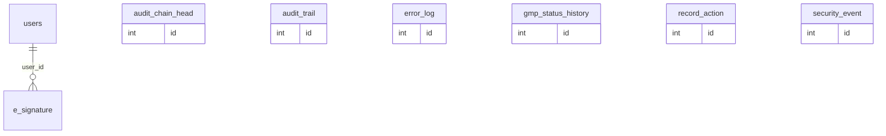

## dispatch

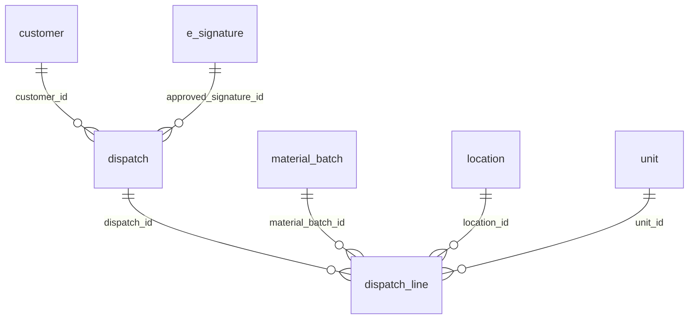

## iam

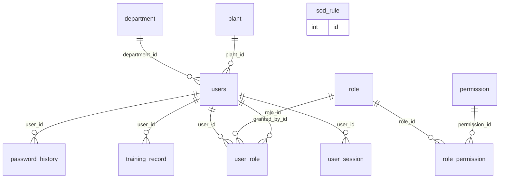

## importing

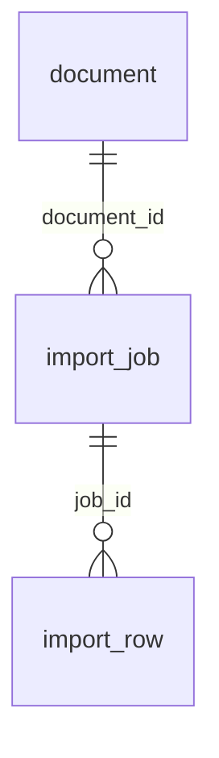

## manufacturing

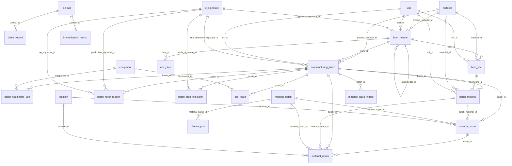

## master

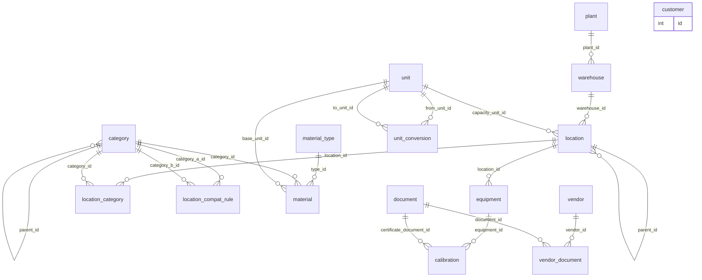

## org

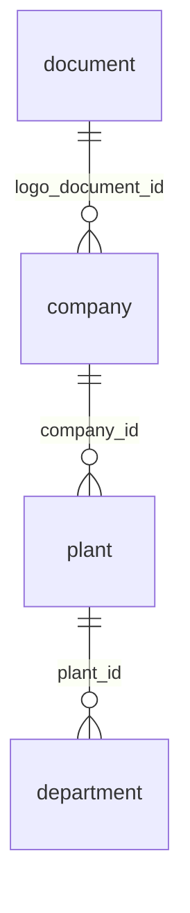

## platform

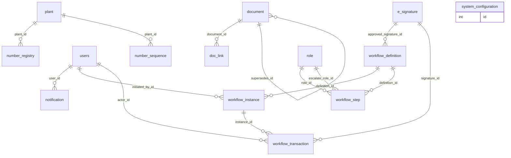

## purchase

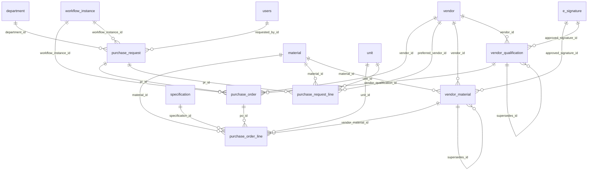

## qc

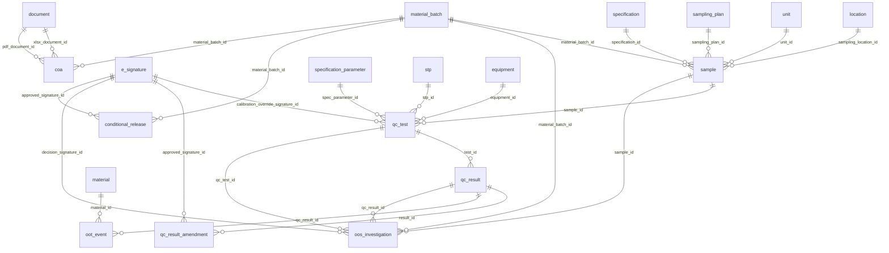

## quality

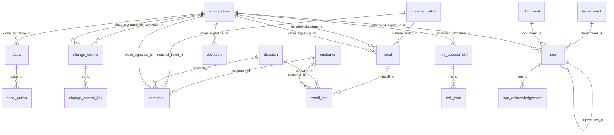

## reporting

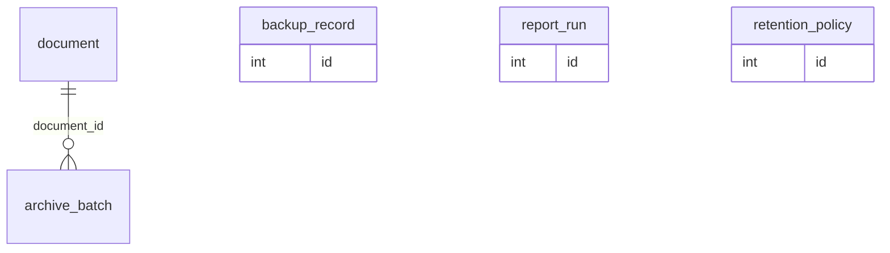

## spec

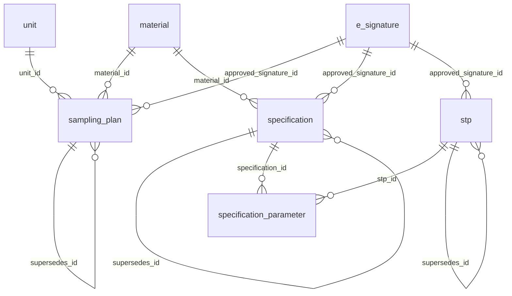

## warehouse

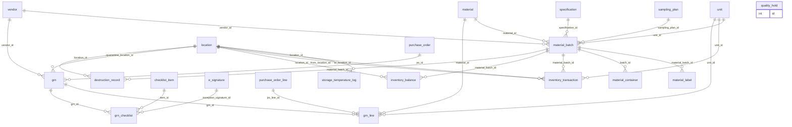
